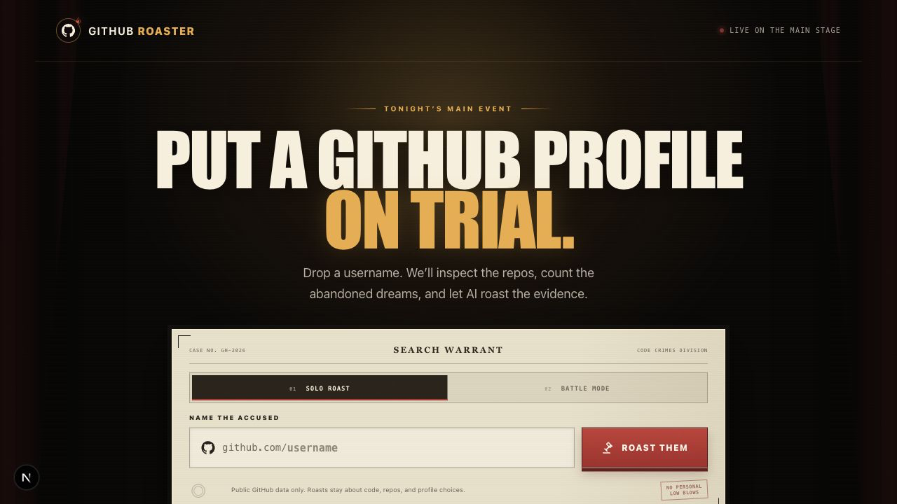

<div align="center">

# Roast My GitHub

### Drop a GitHub username. Let AI expose the repo crimes.

[**Enter the courtroom →**](https://github-roaster-gray.vercel.app/)

</div>



Roast My GitHub turns public commit history into a comedy set. Enter a username, let the app inspect the repos, and watch Groq deliver a theatrical, evidence-backed roast. Feeling competitive? Put two profiles in **Battle Mode** and let the code decide who survives.

## Highlights

| | |
| --- | --- |
| 🔥 **Solo Roast** | One profile. Every stale repo, README crime, and questionable project name on trial. |
| ⚔️ **Roast Battle** | Two GitHub accounts enter. Scores, crimes, winner, finishing move. |
| 🕵️ **Repo Evidence** | Languages, stars, stale projects, missing READMEs, followers, and profile signals. |
| 🎭 **Theatrical Reveal** | Comedy-club staging, animated evidence cards, and a no-mercy verdict. |
| 📸 **Shareable Results** | Download a polished battle card and export the emotional damage. |
| 🔒 **Public Data Only** | Public GitHub signals in. Private life left completely out. |

## Showcase

### Solo Roast

> Your public portfolio enters the evidence locker.


### Battle Mode

> Two developers. One ring. Absolutely no protection from the README audit.


### Share Card

> The verdict, professionally packaged for irresponsible distribution.

<div align="center">
  
</div>

## Battle Mode

Enter two GitHub usernames and the app turns public repo evidence into a head-to-head roast battle:

- roast scores and biggest crimes
- profile-specific punchlines
- a final winner and verdict
- one unnecessary finishing move
- a downloadable result card

It is peer review, if peer review had entrance music.

## Built With

<div align="center">

[](https://nextjs.org/)
[](https://www.typescriptlang.org/)
[](https://tailwindcss.com/)
[](https://www.framer.com/motion/)
[](https://groq.com/)
[](https://docs.github.com/en/rest)
[](https://vercel.com/)

</div>

## Run Locally

```bash
git clone https://github.com/atharv-docs/Roast-My-Github.git
cd Roast-My-Github
npm install
npm run dev
```

---

<div align="center">

Roasts use only public GitHub, code, and project signals—not personal identity, protected traits, or private life.

**Your abandoned side projects may still take this personally.**

</div>
