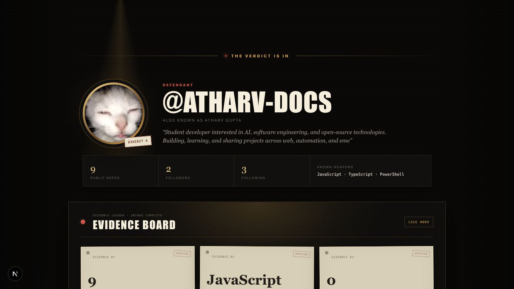
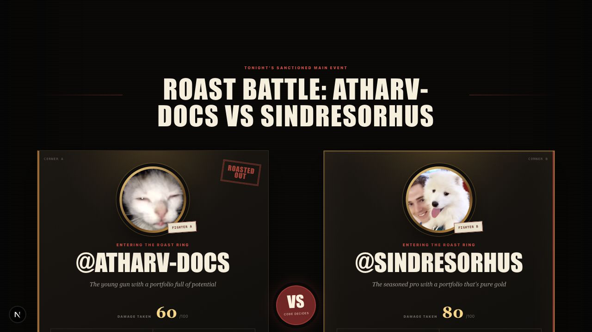
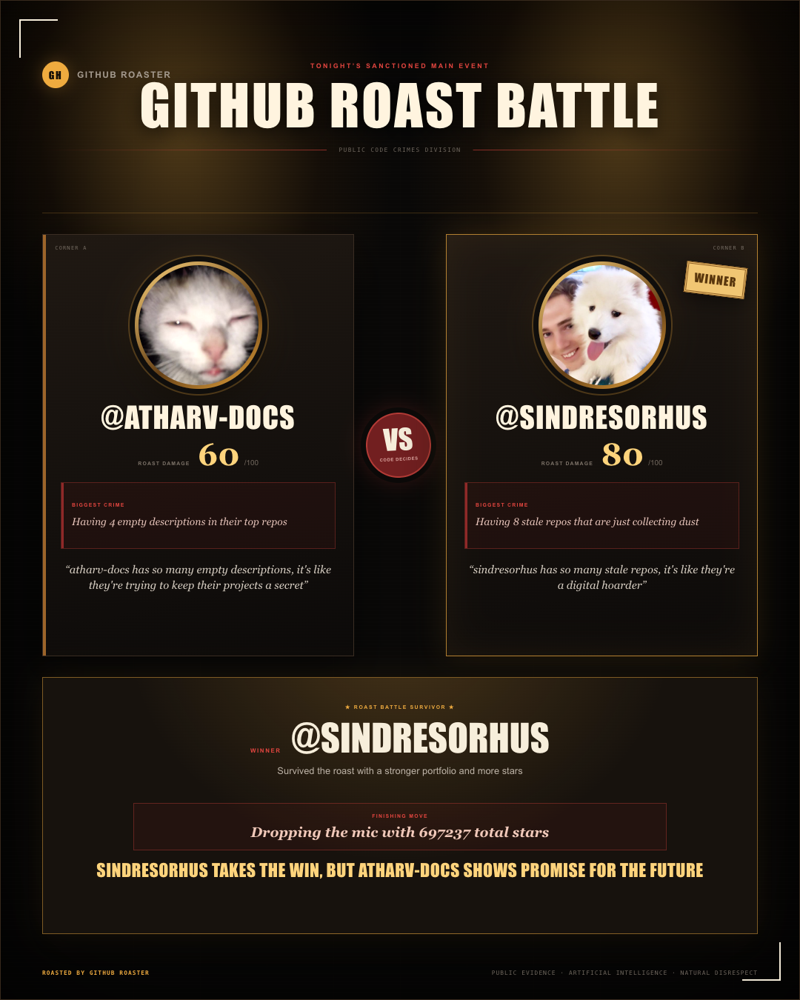

<div align="center">

# 🔥 Roast My GitHub

### Drop a GitHub username. Let AI prosecute the repos.

[](https://nextjs.org/)
[](https://www.typescriptlang.org/)
[](https://tailwindcss.com/)
[](https://groq.com/)
[](https://vercel.com/)

**A comedy club for your commit history, staffed by an AI with senior-reviewer energy.**

[Live Demo](https://github-roaster-gray.vercel.app/)

</div>

> **GitHub repo description suggestion:** “AI-powered GitHub roast generator with solo roasts, battle mode, repo evidence, and shareable verdict cards.”

Roast My GitHub investigates a public GitHub profile, collects the evidence—stale repos, README crimes, suspicious project names, language choices, stars, followers, and more—and hands the case to Groq for a theatrical developer roast. Enter one username for a solo sentencing, or put two profiles in **Battle Mode** and let the codebase carnage decide the winner.

The result is specific, animated, shareable, and just professional enough to count as feedback.

## Preview

Screenshots can be added later under `public/readme/`. The Markdown image placeholders are ready below; uncomment each one when its matching file exists.

### Landing page

<!-- Screenshot placeholder: public/readme/landing.png

-->

> 📸 Screenshot pending: `public/readme/landing.png`

### Solo roast

<!-- Screenshot placeholder: public/readme/solo-roast.png

-->

> 📸 Screenshot pending: `public/readme/solo-roast.png`

### Battle Mode

<!-- Screenshot placeholder: public/readme/battle-mode.png

-->

> 📸 Screenshot pending: `public/readme/battle-mode.png`

### Share card

<!-- Screenshot placeholder: public/readme/share-card.png

-->

> 📸 Screenshot pending: `public/readme/share-card.png`

## Features

- **Solo GitHub roast** — one profile, one stage, nowhere for the abandoned side projects to hide.
- **Roast Battle Mode** — username A versus username B in a deeply unnecessary but statistically supported showdown.
- **Public repo analysis** — inspects repositories, languages, stars, profile stats, and project activity.
- **Stale repo detection** — finds projects that have been “almost done” since the previous JavaScript framework cycle.
- **README crime detection** — spots missing, thin, or suspiciously optimistic documentation.
- **Suspicious repo name detection** — because `final-final-v2-real` is evidence, not a filename.
- **AI-generated verdicts** — Groq turns compact GitHub evidence into targeted roast material.
- **Animated comedy-club reveal** — powered by Framer Motion for maximum dramatic sentencing.
- **Downloadable battle share card** — exports the damage with `html-to-image`.
- **Copy verdict/result** — one click from private embarrassment to team-chat incident.

## How It Works

1. **Enter a username** — submit one GitHub handle, or two for Battle Mode.
2. **Fetch public GitHub data** — the app requests publicly available profile and repository information through the GitHub REST API.
3. **Analyze the repo evidence** — activity, stars, languages, stale projects, README quality, repo names, and other developer-shaped clues are summarized.
4. **Send a compact summary to Groq** — only the relevant public evidence is passed to the roast prompt.
5. **Reveal the roast or verdict** — the lights dim, the animations roll, and technical debt takes the witness stand.

## ⚔️ Battle Mode

Battle Mode puts **username A** and **username B** head-to-head. It compares public stats and repository evidence, assigns roast scores, identifies each developer’s biggest codebase crimes, and declares a winner.

Every battle can include:

- Side-by-side GitHub stats
- Profile-specific roast lines
- Roast scores and biggest crimes
- A declared winner and final verdict
- A finishing move for the losing codebase
- A downloadable, shareable battle card

No merge conflicts are resolved. Reputations may not be so lucky.

## Tech Stack

| Technology | Job in the courtroom |
| --- | --- |
| [Next.js](https://nextjs.org/) | App Router, UI, and server-side API routes |
| [TypeScript](https://www.typescriptlang.org/) | Keeps the roast engine typed, even when the jokes are unhinged |
| [Tailwind CSS](https://tailwindcss.com/) | Responsive styling and comedy-club polish |
| [Framer Motion](https://www.framer.com/motion/) | Animated reveals, transitions, and dramatic pauses |
| [Groq API](https://groq.com/) | Fast AI-generated roasts and battle verdicts |
| [GitHub REST API](https://docs.github.com/en/rest) | Public profile and repository evidence |
| [`html-to-image`](https://github.com/bubkoo/html-to-image) | Downloadable verdict and battle share cards |
| [Vercel](https://vercel.com/) | Deployment and hosting |

## Environment Variables

Create a `.env.local` file in the project root:

```env
GROQ_API_KEY=your_groq_api_key
GITHUB_TOKEN=optional_github_token
```

`GROQ_API_KEY` is required for roast generation. `GITHUB_TOKEN` is optional, but recommended for higher GitHub API rate limits. Never commit `.env.local` or expose either value in client-side code.

## Run Locally

```bash
git clone https://github.com/atharv-docs/Roast-My-Github.git
cd Roast-My-Github
npm install
npm run dev
```

Open [http://localhost:3000](http://localhost:3000), enter a GitHub username, and prepare a statement for the defense.

## Deployment

Deploy the repository to [Vercel](https://vercel.com/), then add `GROQ_API_KEY` and, optionally, `GITHUB_TOKEN` under **Project Settings → Environment Variables**. Redeploy after saving the variables.

That is the whole production ritual. Vercel handles the build; the AI handles the character assassination of `todo-app-7`.

## Project Architecture

```txt
app/
  api/
    roast/
    battle/
  components/
  page.tsx
lib/
public/
```

- `app/api/roast/` builds solo roast responses.
- `app/api/battle/` compares two profiles and returns the battle verdict.
- `app/components/` contains the interface, results, and share-card views.
- `lib/` contains GitHub data collection and Groq integration logic.
- `public/` holds static assets, including future README screenshots.

## AI Behavior & Roast Safety

The prompts are designed to make every roast **specific, funny, evidence-based, and limited to GitHub activity**. The app critiques code, repositories, project habits, documentation, public profile stats, and developer behavior visible through public GitHub data.

It does **not** roast or infer personal traits, identity, appearance, family, religion, race, gender, sexuality, disability, private life, or any other protected or sensitive characteristic. Roast My GitHub uses **public GitHub data only**—no private repositories, private profile data, or hidden account information.

In short: your empty README is fair game. Your humanity is not.

## Roadmap

- [ ] More roast modes
- [ ] Public leaderboard
- [ ] GitHub Wrapped, but evil
- [ ] Roast history
- [ ] More share-card formats
- [ ] Custom roast intensity

## Disclaimer

> **“This app may emotionally damage your abandoned side projects.”**

Roasts are generated for entertainment and developer-friendly critique. Results can be copied, downloaded, laughed at, and—under extreme circumstances—used as motivation to finally archive that repo.

## Credits

Built by the project team, with public GitHub evidence, fast inference from Groq, and a completely reasonable amount of concern about your commit messages.

## License

License information will be added here. Until then, please treat the source as **all rights reserved** unless the repository owner states otherwise.
